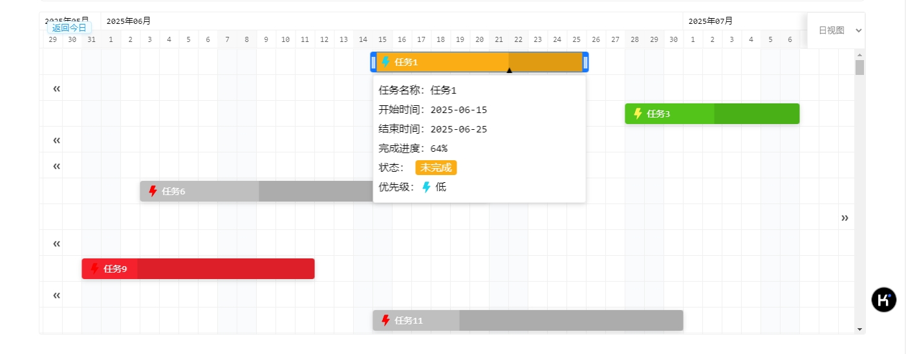

# AGantt.js

## 介绍
AGantt.js 是一个使用 JS 开发的甘特图组件，支持自定义数据源，支持自定义样式。



## 特性
- 支持自定义数据源
- 支持自定义任务条样式
- 支持自定义时间轴样式
- 支持自定义 tooltip 样式
- 支持自定义拖拽时的遮罩层样式
- 支持日视图、周视图、月视图、季度视图、年视图

## 基础使用

首先引入组件
```html
<script src="../dist/AGantt.umd.js"></script>
```

然后创建一个容器，并初始化组件
```html
<div id="app"></div>
```

```js
const tasks = [
  {
    id: 1,
    title: "任务1",
    startDate: "2024-07-25",
    endDate: "2024-08-29",
    progress: 0.64,
    priority: "中",
    status: "error",
  },
  {
    id: 2,
    title: "任务2",
    startDate: "2024-06-25",
    endDate: "2024-06-29",
    progress: 0.59,
    priority: "中",
    status: "error",
  },
];

const gantt = new AGantt("#app", tasks, {
      viewType: "day", // 视图类型：quarter
      showViewTypeSwitch: true, // 是否显示视图切换按钮
      showBackToday: true, // 是否显示返回今日按钮
      lineColor: "#f0f0f0", // 线条颜色
      curDayLineColor: "#1890ff", // 当天日期的线条颜色
      weekBarBg: "#fafbfd", // 周末条的背景色
      onViewTypeChange: (viewType) => {
        console.log(viewType);
      },
      // 点击任务条时触发
      onTaskBarClick: (taskData) => {
        alert(taskData.title);
      },
      // 点击时间轴时触发
      onTimelineClick: (data) => {
        alert(data);
      },
      // 是否显示拖拽时的遮罩层
      showDragMask: true,
      // 是否显示tooltip
      showTooltip: true,
      // 自定义tooltip，当 showTooltip 为 true 时，生效
      renderTooltip: (taskData) => {
        const status = {
          success: "已完成",
          warning: "未完成",
          error: "已超期",
          default: "进行中",
        };

        return `
    <div style="
      min-width: 200px;
      padding: 8px; 
      line-height: 30px; 
      background-color: #fff; 
      border: 1px solid #eee; 
      border-radius: 4px; 
      margin-top: 4px; 
      font-size: 16px;
      box-shadow: 0 2px 8px rgba(0,0,0,.15);"
    >
      <div>任务名称：${taskData.title}</div>
      <div>开始时间：${taskData.startDate}</div>
      <div>结束时间：${taskData.endDate}</div>
      <div>完成进度：${Math.round(taskData.progress * 100)}%</div>
      <div>状态：
        <span style="background: ${
          bgColor[taskData.status]
        }; border-radius: 4px; padding: 2px 8px; color: #fff;">
          ${status[taskData.status]}
        </span>
      </div>
      <div style="display: flex; align-items: center;">优先级：
        <span style="
        width: 20px;
        height: 20px;
        display: flex;
        justify-content: center;
        align-items: center;
        margin-right: 4px;
        ">
          ${priorityIcon[taskData.priority]}
        </span>
        ${taskData.priority}
      </div>
    </div>
    `;
      },
      // 自定义taskbar的内容
      renderTaskbarContent: (taskData) => {
        return `
    <div style="
      width: 100%;
      height: 100%;
      padding: 0 10px;
      background-color: ${bgColor[taskData.status]};
      border-radius: 4px;
      box-shadow: 0 2px 8px rgba(0,0,0,.15);
      cursor: pointer;
      display: flex;
      align-items: center;
      color: #fff;
      font-size: 14px;
      overflow: visible;
      white-space: nowrap;
    ">
      <span style="
        width: 20px;
        height: 20px;
        display: flex;
        justify-content: center;
        align-items: center;
        margin-right: 4px;
      ">
        ${priorityIcon[taskData.priority]}
      </span>
      ${taskData.title}
    </div>
    `;
      },
    });
```

## 插件开发

### 安装依赖
```shell
npm install
```

### 打包
```shell
npm run build
```